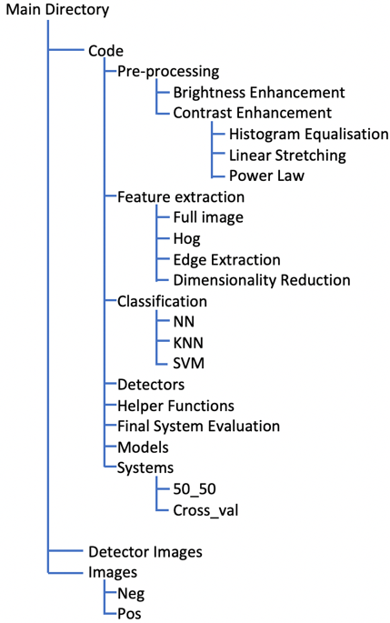

Objective:
The objective of this computer vision project was to create a functional pedestrain classification and system. The project was created in MATLAB utilising a plethora of machine learning and video analyitcal techniques and models. Some of the ML techniques used throughout this project include: KNN, SVM, Random Forests, Histogram of Gradients, cross validation etc.

A recognition system pipeline was followed with various stages including pre-processing, segmentation, feature extraction etc. Various techniques and methods of computer vision were used at each stage of this pipeline. 

Pre-Processing:
This was the first stage of the system pipeline which involved the application of pre-processing techniques to the training and test images, in the aim of improving the accuracy of the classification system. The pre-processing techniques utilised were: brightness enhancement, histogram equalisation, linear stretching and power law. Each of these techniques were applied to the images and the accuracy calculated.

Feature Extraction:
The next stage was to extract useful features from the pre-processed images. The techniques used in this stage included full image, Histogram of Gradients, Edge extraction and dimensionality reduction using PCA (Principal Component Analysis) and LDA (Linear Discriminant Analysis). Each of these feature extractor methods were compared and contrasted and the accuracy calculated. In the final system, HOG proved to be the most accurate and robust for pedestrian detection. 

Classification:
Next was the classification of the pedestrians within the images that have had pre-processing and feature extraction applied to them. Four types of classifiers were used; KNN, NN, SVM and Random Forests. Each of these were compared and constrasted in order to find the most effective and accurate classifer. For the final pedestrian detection system, Support Vector Machines (SVM) were used as it proved to be the most accurate and efficient in regards to computational complexity. 

Detection:
The final step of the pipeline was the utilisation of the system and model created in the detection of pedestrians in a new image dataset. 
